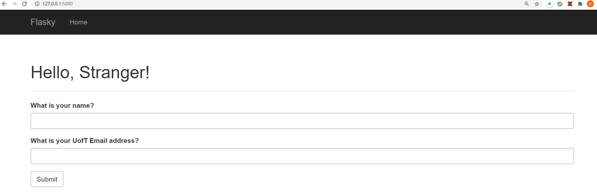

# ECE444-F2020-Lab3

Activity 1:

Activity 2:

Activity 3:
SQL database stores data in table and use record. 
NoSQL databases uses collections instead of tables and documents instead of records.
SQL databases excel at storing structured data in an efficient and compact form. These databases go to great lengths to preserve consistency. NoSQL databases relax some of the consistency requirements and as a result can sometimes get a performance edge.

