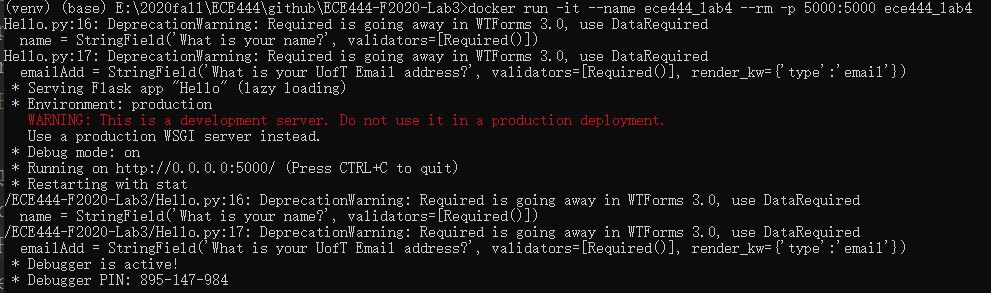
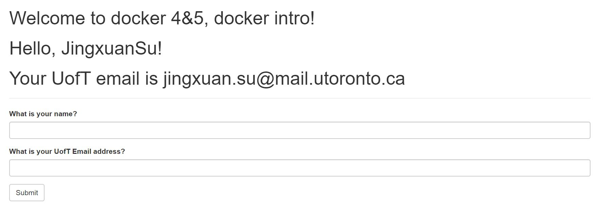
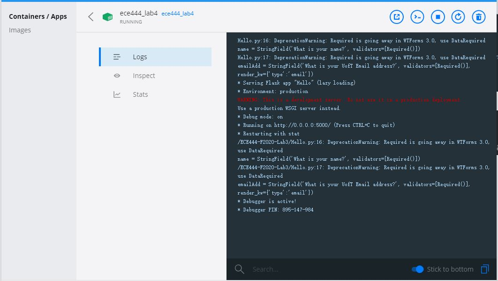

# ECE444-F2020-Lab4

How to run: 
In cmd, move to this directory, do:" docker build -t ece444_lab4:latest . " to build the docker image
Then do: " docker run -it --name ece444_lab4 --rm -p 5000:5000 ece444_lab4 " to start running

Docker file location: in this folder called Dockerfile

Activity 2:

Activity 3:
A virtualenv only contains Python dependencies. You can switch the python version and the package installed easily. But it is still running on the current computer and current OS. A Docker container contains an entire OS. You can run in different OS on any computer so long as you pull the corresponding image. The os is not depend on the current computer.
